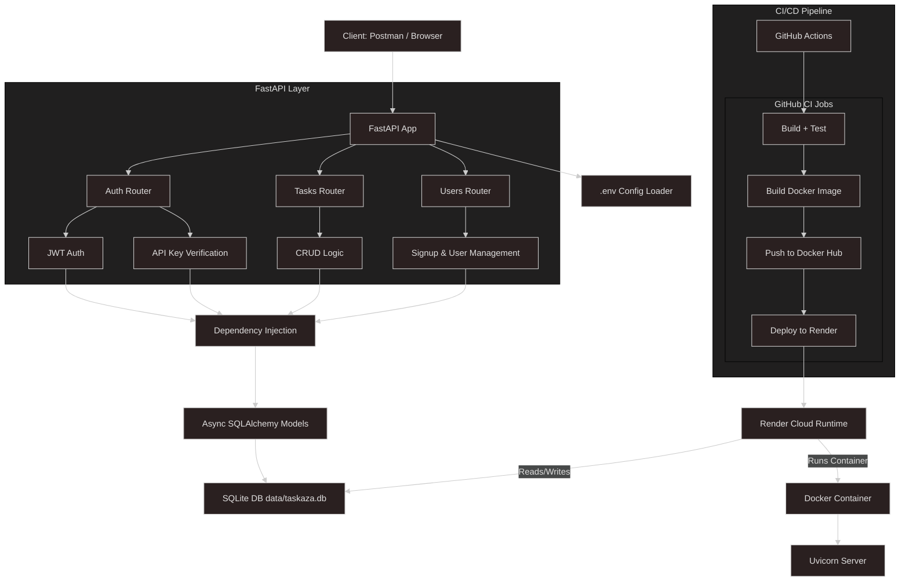
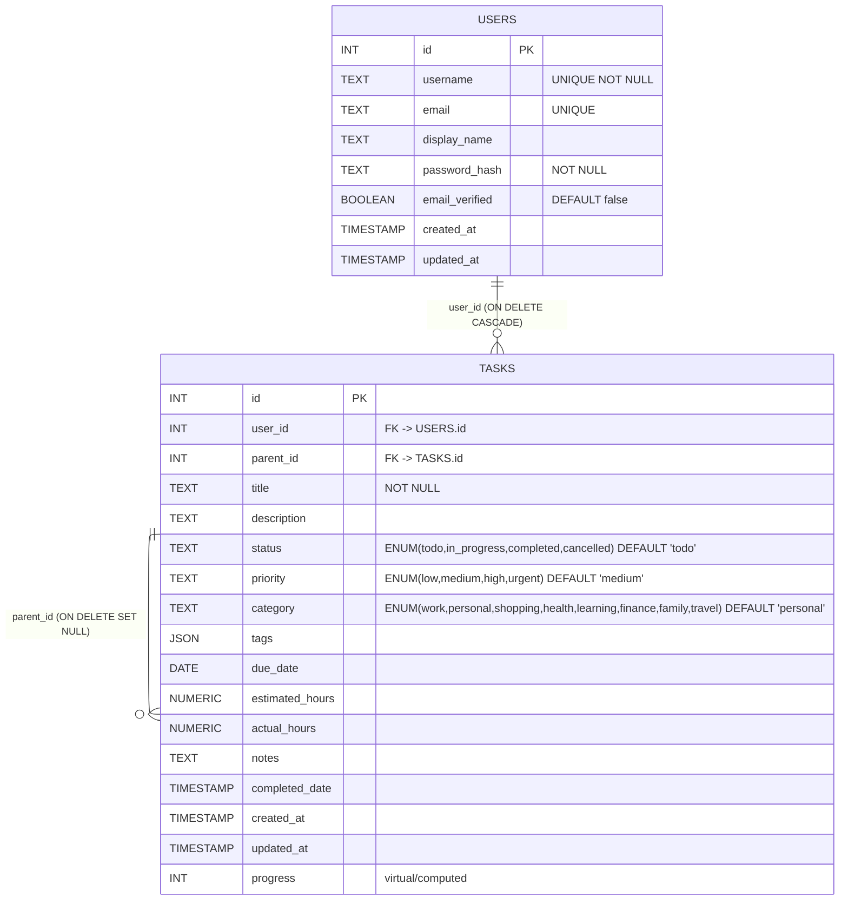
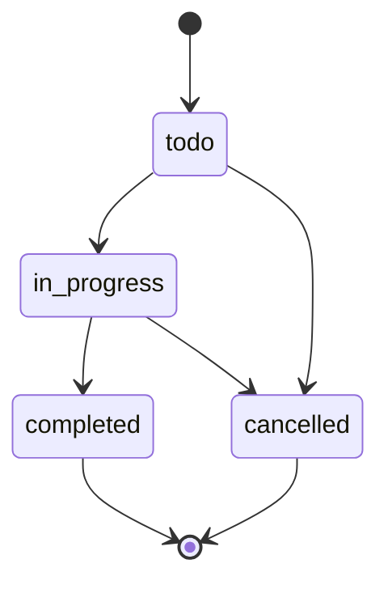

## 🧱 Architecture

The **Taskaza** API is a secure, containerized task management system built with FastAPI, designed around clean separation of concerns, robust authentication, and cloud-native deployment.

### 🔐 Security

* **OAuth2 + JWT** authentication with secure password hashing
* **API Key** validation for all protected routes
* `.env`-based secret injection (or Render env dashboard)

### Data Model

The ER diagram below captures the core tables and relationships for user-owned tasks, including self-referential parent-child links.

### State Diagram
- For Task.status transitions & rules
- When: preventing invalid updates in UI/backend.

### ⚙️ Components

| Layer           | Description                                                       |
| --------------- | ----------------------------------------------------------------- |
| **FastAPI**     | Async REST API framework with dependency injection                |
| **Auth**        | OAuth2 Password flow (JWT) + API Key (`X-API-Key`)                |
| **Database**    | SQLite with async SQLAlchemy models                               |
| **Pydantic v2** | Input/output schema validation with examples                      |
| **Docker**      | Containerized build for reproducible deployment                   |
| **CI/CD**       | GitHub Actions: test → build Docker → deploy to Render            |
| **Render**      | Cloud platform running Docker-based deployment with auto-redeploy |